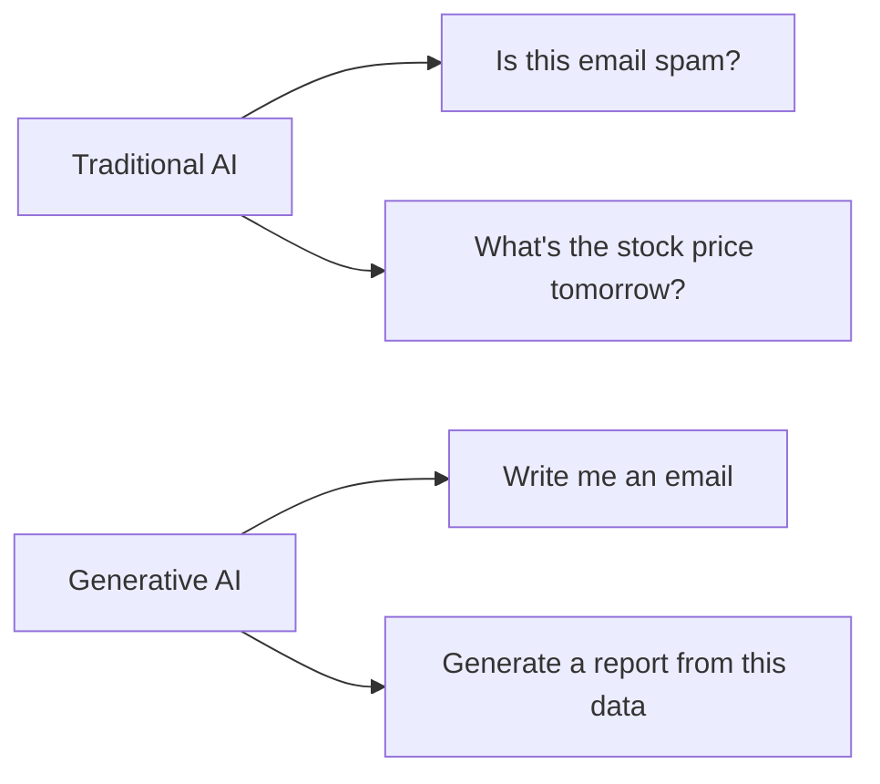
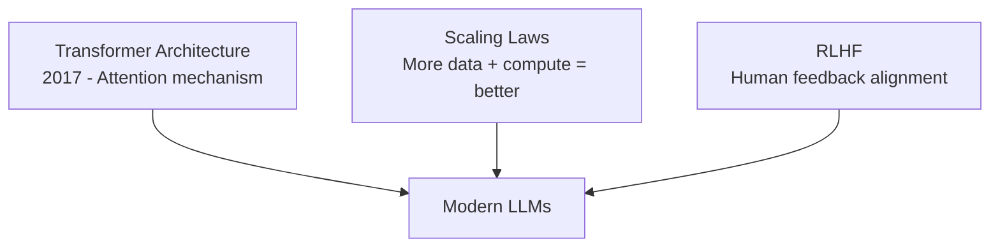
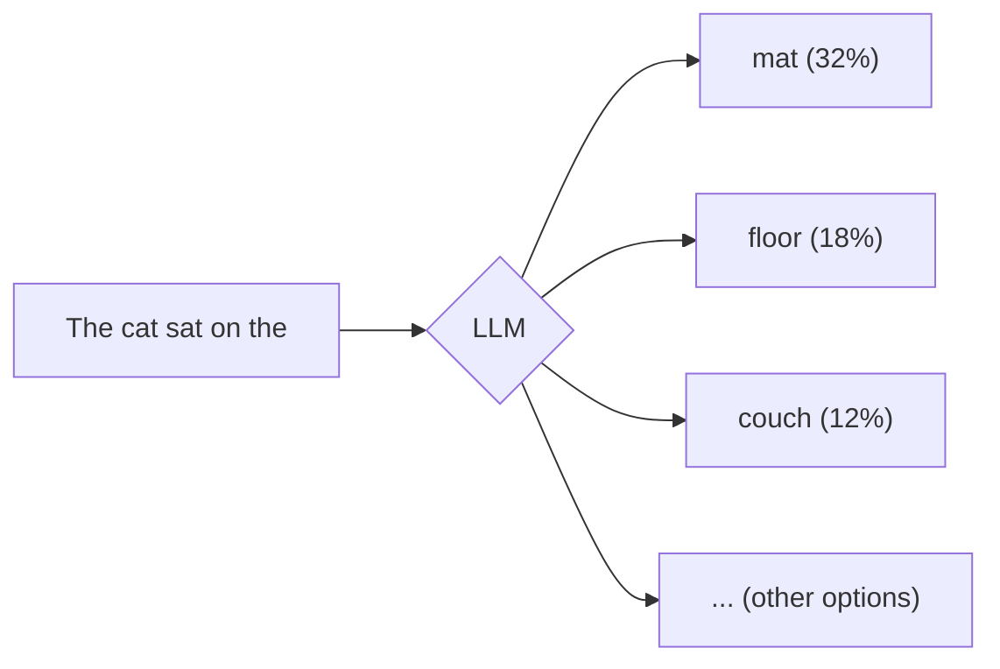
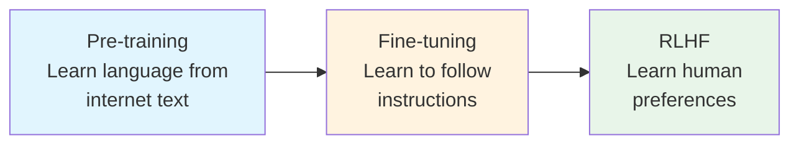
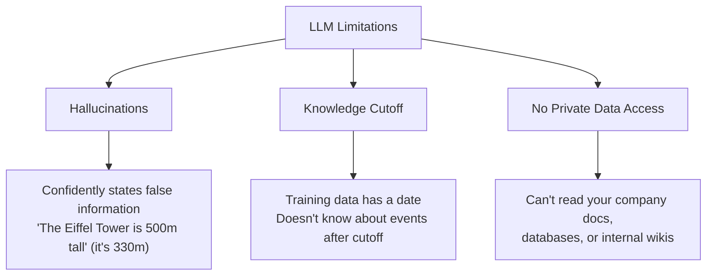
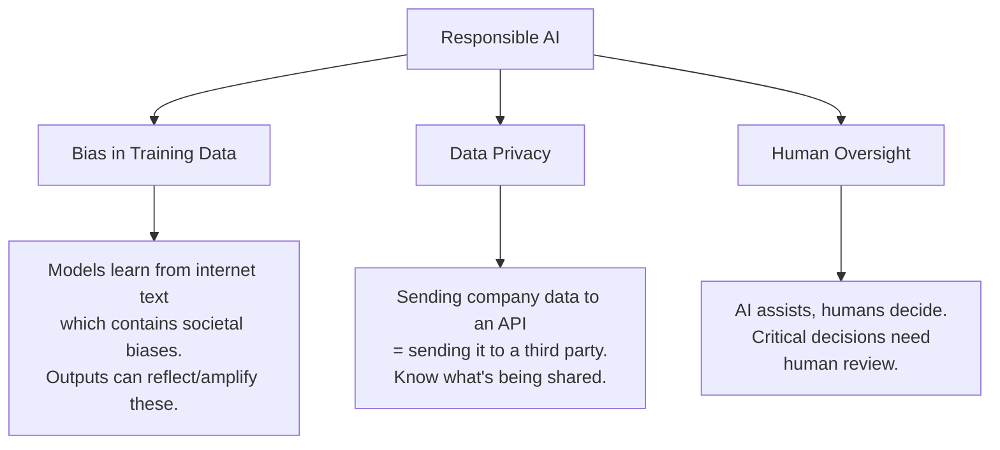
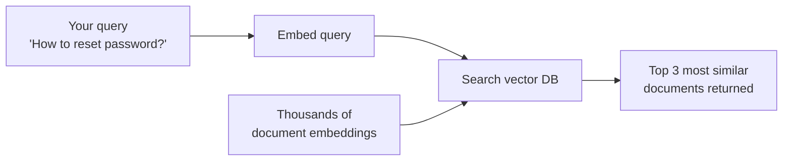
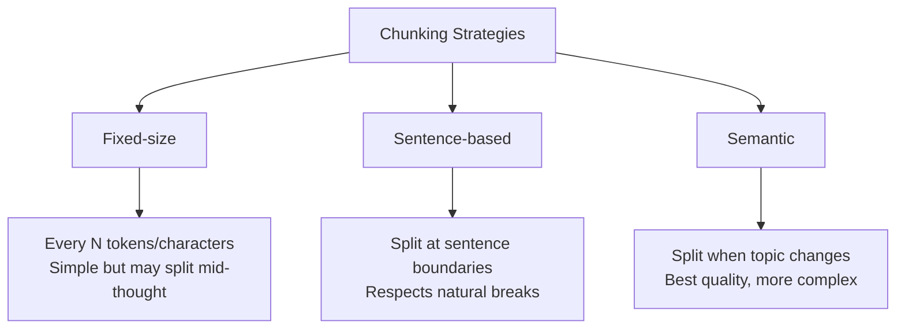
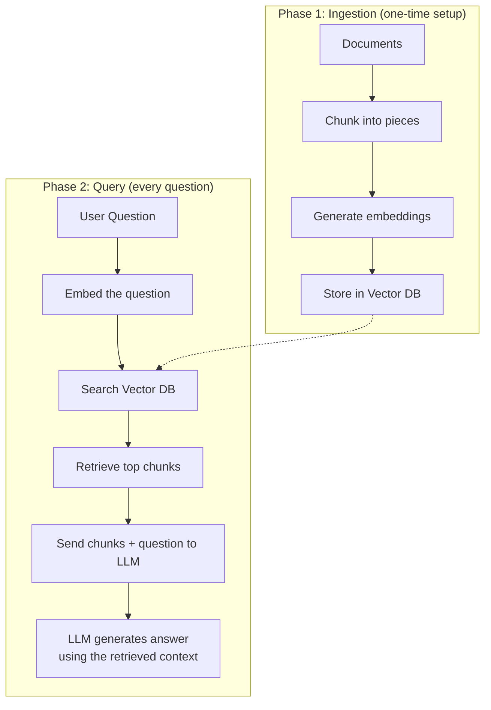

# GenAI Fundamentals — Reference Guide

> A visual guide to how Generative AI works, from tokens to RAG pipelines.

---

## 1. The Big Picture

### What is Generative AI?

Traditional AI/ML **classifies** or **predicts** from existing patterns.  
Generative AI **creates new content** — text, images, code, music — that didn't exist before.



### The Landscape (2024-2025)

| Provider | Models | Type |
|----------|--------|------|
| OpenAI | GPT-4, GPT-4o | Closed-source |
| Anthropic | Claude 4, Claude Sonnet | Closed-source |
| Google | Gemini 2.0 | Closed-source |
| Meta | Llama 3 | Open-source |
| Mistral | Mistral Large, Mixtral | Open-source |

### Why Now?

Three breakthroughs converged:



---

## 2. How LLMs Work

### Tokens: The Atoms of Language

LLMs don't read words — they read **tokens**. A token is roughly 3/4 of a word.

```
Input:  "The cat sat on the mat"
Tokens: ["The", " cat", " sat", " on", " the", " mat"]
IDs:    [464,   3797,  3332,  319,   262,   2603]
```

```
Input:  "Unbelievable!"
Tokens: ["Un", "believ", "able", "!"]
IDs:    [1829, 14501,   540,    0]
```

> **Key insight**: The model sees numbers, not words. Everything is math.

### The Prediction Machine

An LLM does ONE thing: **predict the next token**.



It generates text by predicting one token at a time, feeding each prediction back as input:

```
Step 1: "The cat" → predicts "sat"
Step 2: "The cat sat" → predicts "on"
Step 3: "The cat sat on" → predicts "the"
Step 4: "The cat sat on the" → predicts "mat"
```

### Training Pipeline



| Stage | What happens | Data |
|-------|-------------|------|
| Pre-training | Reads billions of pages, learns patterns | Books, web, code |
| Fine-tuning | Learns to be a helpful assistant | Q&A pairs |
| RLHF | Learns what humans prefer | Human rankings |

### Context Window = Working Memory

The context window is how much text the model can "see" at once.

```
┌─────────────────────────────────────────────────────┐
│              Context Window (e.g., 128K tokens)      │
│                                                     │
│  ┌──────────┐  ┌──────────────┐  ┌──────────────┐  │
│  │ System   │  │ Conversation │  │   Response   │  │
│  │ Prompt   │  │   History    │  │  Being Made  │  │
│  └──────────┘  └──────────────┘  └──────────────┘  │
│                                                     │
│  Everything must fit in here ←──────────────────    │
└─────────────────────────────────────────────────────┘
```

> **Analogy**: Context window is like a desk. Everything the model is "thinking about" must fit on the desk. Bigger desk = can handle longer documents.

### Temperature: Creativity vs. Precision

Temperature controls how "creative" (random) the model's choices are.

```
Temperature = 0.0 (Deterministic)
"The capital of France is" → "Paris" (always)

Temperature = 0.7 (Balanced)
"Write a poem about" → varies each time, coherent

Temperature = 1.5 (Very creative)
"Write a poem about" → wild, unexpected, sometimes nonsensical
```

```
Low temp (0.0)          High temp (1.5)
    ████                    ██
    ████                    ██  ██
    ████  ██                ██  ██  ██  ██
    ████  ██  █             ██  ██  ██  ██  ██
    ─────────────           ─────────────────
    "mat" "rug" "floor"     "mat" "rug" "floor" "sky" "dream"
    
    Focused, predictable    Spread out, surprising
```

---

## 3. Limitations, Risks & Practical Realities

### The Three Gaps



### Responsible AI Considerations



**Key questions to ask before deploying:**
- What data am I sending to this API? Is it sensitive?
- Could bias in outputs affect people (hiring, lending, healthcare)?
- Who reviews the AI's output before it reaches end users?

### Cost Awareness

| Operation | Approximate Cost |
|-----------|-----------------|
| GPT-4 input | ~$2-5 per 1M tokens |
| Embedding 1M tokens | ~$0.10 |
| Vector DB storage | Pennies per 1K documents |
| Fine-tuning | $100s-$1000s per run |

> Costs add up fast at scale. A chatbot handling 10K queries/day can cost $100+/day in API calls. Design matters.

### The Gap Visualized

```
What the LLM knows:           What you need:
┌─────────────────┐           ┌─────────────────┐
│  General world  │           │  Your company's  │
│  knowledge up   │           │  policies, docs, │
│  to training    │    GAP    │  recent data,    │
│  cutoff date    │◄─────────►│  proprietary     │
│                 │           │  information     │
└─────────────────┘           └─────────────────┘

         ▼ Solution: RAG bridges this gap ▼
```

---

## 4. Embeddings & Vector Search

### What Are Embeddings?

An embedding converts text into a list of numbers (a "vector") that captures its **meaning**.

```
"king"   → [0.21, 0.83, -0.45, 0.67, ... ] (768 numbers)
"queen"  → [0.19, 0.81, -0.42, 0.71, ... ] (768 numbers)
"banana" → [0.92, -0.31, 0.55, -0.12, ... ] (768 numbers)
```

> **Key insight**: Similar meanings → similar numbers. "King" and "queen" have similar vectors. "Banana" is far away.

### Semantic Space — A Visual

Imagine plotting words in space by their meaning:

```
        "happy" ●
                    ● "joyful"
                ● "cheerful"
    
    
                                    ● "sad"
                                ● "unhappy"
                            ● "depressed"
    
    
● "python"
    ● "javascript"
        ● "coding"
```

Words with similar meanings cluster together — regardless of spelling or language!

### Cosine Similarity — "How Similar?"

Cosine similarity measures the angle between two vectors. Think of it as arrows:

```
        Same direction = Similar meaning
        ↗ ↗  (cosine ≈ 1.0)

        Perpendicular = Unrelated  
        ↗ →  (cosine ≈ 0.0)

        Opposite = Opposite meaning
        ↗ ↙  (cosine ≈ -1.0)
```

**Example similarity scores:**

| Sentence A | Sentence B | Similarity |
|-----------|-----------|-----------|
| "How do I reset my password?" | "I forgot my login credentials" | 0.92 |
| "How do I reset my password?" | "What's the weather today?" | 0.13 |
| "The cat sat on the mat" | "A feline rested on the rug" | 0.89 |

### Vector Databases — The Semantic Search Engine

A vector database stores embeddings and finds the most similar ones quickly.



> **Analogy**: Traditional search is like looking up a word in an index. Vector search is like asking a librarian "I need something about THIS topic" and they find relevant books even if they use different words.

---

## 5. Chunking & Document Processing

### Why Chunk?

You can't embed an entire 100-page document as one vector — it would lose all detail. Instead, break it into meaningful pieces.

```
┌─────────────────────────────────────────────┐
│           100-page Document                  │
│                                             │
│  Too large → meaning gets diluted           │
│  Search would return the whole doc           │
└─────────────────────────────────────────────┘
                    │
                    ▼ CHUNK
┌──────┐ ┌──────┐ ┌──────┐ ┌──────┐ ┌──────┐
│Chunk1│ │Chunk2│ │Chunk3│ │Chunk4│ │Chunk5│
│      │ │      │ │      │ │      │ │      │
│~500  │ │~500  │ │~500  │ │~500  │ │~500  │
│tokens│ │tokens│ │tokens│ │tokens│ │tokens│
└──────┘ └──────┘ └──────┘ └──────┘ └──────┘
                    │
    Each chunk gets its own embedding
    Each can be retrieved independently
```

### Chunking Strategies



### Overlap: Don't Lose Context at Boundaries

Without overlap, you might split a key idea in half:

```
WITHOUT overlap:
[...the password policy requires] [8 characters and a special...]
         Chunk 1 ends ↑            ↑ Chunk 2 starts
         
         Neither chunk has the full rule!

WITH overlap (e.g., 50 tokens):
[...the password policy requires 8 characters and a special...]
[...requires 8 characters and a special symbol. Users should...]
         ↑ Shared content ensures completeness ↑
```

---

## 6. RAG End-to-End

### What is RAG?

**R**etrieval-**A**ugmented **G**eneration = Give the LLM relevant information BEFORE asking it to answer.

> **Analogy**: Instead of asking someone a question from memory, you first hand them the relevant pages from a textbook, THEN ask.

### The Full Pipeline



### Step-by-Step Walkthrough

```
SETUP (once):
─────────────
1. Take your documents (PDFs, wikis, docs)
2. Split them into chunks (~500 tokens each, with overlap)
3. Convert each chunk into an embedding (vector of numbers)
4. Store all embeddings in a vector database

QUERY (every time a user asks):
────────────────────────────────
1. User asks: "What is our refund policy?"
2. Convert question to embedding
3. Find the 3-5 most similar chunks in the vector DB
4. Send to LLM: "Using ONLY the following context, answer the question:
   [chunk 1 text] [chunk 2 text] [chunk 3 text]
   Question: What is our refund policy?"
5. LLM answers based on YOUR documents, not its training data
```

### What is Fine-tuning?

Fine-tuning takes a pre-trained model and trains it further on your specific data. The model's weights actually change — it "learns" your patterns.

```
┌──────────────────┐      ┌──────────────────┐      ┌──────────────────┐
│   Base Model     │  +   │   Your Data      │  =   │  Specialized     │
│   (GPT, Claude,  │      │   (input/output  │      │  Model           │
│    Llama, etc.)  │      │    examples)     │      │  (your style/    │
│                  │      │                  │      │   behavior)      │
└──────────────────┘      └──────────────────┘      └──────────────────┘
```

> **Analogy**: Like hiring a trained chef and teaching them YOUR restaurant's recipes. They already know how to cook — you're specializing their skills.

**Common use cases:** custom brand voice, domain-specific language (medical, legal), consistent output formatting.

### Why RAG Over Fine-tuning?

| Factor | RAG | Fine-tuning |
|--------|-----|-------------|
| Data freshness | Always current (update docs anytime) | Frozen at training time |
| Cost | Cheap (just storage + search) | Expensive (GPU training) |
| Accuracy | Cites sources, reducees hallucination | May still hallucinate |
| Setup time | Hours | Days to weeks |
| Best for | Facts, docs, knowledge bases | Style, tone, behavior |

---

## 7. Prompt Engineering Essentials

### System Prompts: Setting the Stage

The system prompt tells the model WHO it is and HOW to behave:

```
┌─ System Prompt ─────────────────────────────────┐
│ You are a helpful customer service agent for     │
│ Acme Corp. Be concise, professional, and always │
│ cite the relevant policy number when answering.  │
│ If you don't know, say "I don't know."          │
└─────────────────────────────────────────────────┘
```

### Few-Shot: Teaching by Example

Show the model what you want by giving examples:

```
Convert these to formal language:

Input: "Hey, can u fix this ASAP?"
Output: "Hello, could you please address this at your earliest convenience?"

Input: "thx for the help!"
Output: "Thank you for your assistance."

Input: "gonna need that report by tmrw"
Output: ?
```

The model learns the pattern and continues it.

### Chain-of-Thought: "Think Step by Step"

Adding "think step by step" dramatically improves reasoning:

```
WITHOUT chain-of-thought:
Q: "If a shirt costs $25 and is 20% off, what do I pay?"
A: "$20" ← just the answer, sometimes wrong

WITH chain-of-thought:
Q: "Think step by step. A shirt costs $25 and is 20% off..."
A: "Step 1: 20% of $25 = $5
    Step 2: $25 - $5 = $20
    Answer: $20" ← shows work, more reliable
```

---

## Quick Reference Card

```
┌─────────────────────────────────────────────────────────┐
│                   GenAI CHEAT SHEET                      │
├─────────────────────────────────────────────────────────┤
│                                                         │
│  TOKEN     = A piece of a word (~4 chars)               │
│  LLM       = Predicts next token, trained on text       │
│  EMBEDDING = Text converted to meaningful numbers       │
│  VECTOR DB = Database that finds similar embeddings     │
│  CHUNKING  = Breaking documents into small pieces       │
│  RAG       = Retrieve relevant docs, then generate      │
│                                                         │
│  RAG Pipeline:                                          │
│  Docs → Chunk → Embed → Store → Query → Retrieve → LLM │
│                                                         │
│  Prompt Tips:                                           │
│  • Set context with system prompts                      │
│  • Show examples (few-shot)                             │
│  • Ask to "think step by step"                          │
│                                                         │
└─────────────────────────────────────────────────────────┘
```

---

*Next session: We'll build a working RAG pipeline in Python!*
